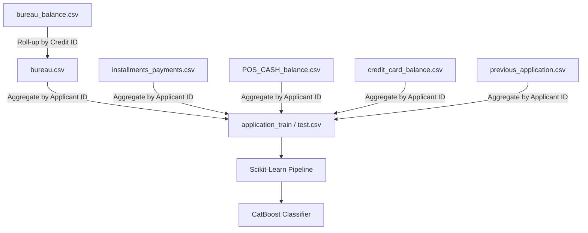

# Home Credit Default Risk Predictor (Production-Grade Modular Pipeline)

[](https://www.python.org/)
[](https://catboost.ai/)
[](https://scikit-learn.org/)
[](https://www.kaggle.com/c/home-credit-default-risk)

This repository implements a production-grade, modular machine learning pipeline to predict the default risk of credit applicants. The architecture addresses severe class imbalance (~8% default rate vs. ~92% repayment rate) and leverages complex feature engineering across multiple relational database tables to achieve an **ROC AUC score of 0.7927** on the test set.

Originally written as a monolithic Jupyter Notebook, the project has been fully restructured into a modular Python package adhering to software engineering clean-code design principles, complete with configuration files, separate training/inference scripts, robust unit tests, and data mocking utilities for rapid local execution.

---

## 📂 Repository Structure

The project is organized as follows:

```
Home_Credit_Default/
│
├── src/                                # Source module package
│   ├── __init__.py                     # Package initializer
│   ├── config.py                       # Central configurations, aggregation dictionaries, and parameters
│   ├── preprocessing.py                # Row-level and table-level aggregations & interaction features
│   ├── transformers.py                 # Custom Scikit-Learn pipeline transformers
│   ├── pipeline.py                     # Scikit-Learn Pipeline constructor wrapping CatBoost
│   └── utils.py                        # Memory reduction downcaster, plotting helpers, and data mock generator
│
├── tests/                              # Unit testing suite
│   ├── test_transformers.py            # Unit tests for custom transformers
│   └── test_utils.py                   # Unit tests for utility functions
│
├── train.py                            # Main script to download data, preprocess, train, evaluate, and save pipeline
├── predict.py                          # Main script to load the trained model pipeline and output predictions
├── demo.ipynb                          # Cleaned notebook walking through the modular imports and pipeline flow
├── requirements.txt                    # Project dependencies
└── README.md                           # Comprehensive guide and documentation (this file)
```

### 🔗 Quick Links to Files & Modules
- Central configurations: [src/config.py](src/config.py)
- Data aggregations: [src/preprocessing.py](src/preprocessing.py)
- Custom transformers: [src/transformers.py](src/transformers.py)
- Pipeline construction: [src/pipeline.py](src/pipeline.py)
- Memory and mock utility functions: [src/utils.py](src/utils.py)
- Testing suite: [tests/test_transformers.py](tests/test_transformers.py) and [tests/test_utils.py](tests/test_utils.py)
- Entry scripts: [train.py](train.py) and [predict.py](predict.py)
- Demo notebook: [demo.ipynb](demo.ipynb)

---

## ⚡ Setup & Installation

1. Clone the repository and navigate to the project root:
   ```bash
   git clone https://github.com/TareKelKhateb/Home_Credit_Default.git
   cd Home_Credit_Default
   ```

2. (Optional but recommended) Create and activate a virtual environment:
   ```bash
   python -m venv venv
   # On Windows:
   .\venv\Scripts\activate
   # On macOS/Linux:
   source venv/bin/activate
   ```

3. Install the required dependencies:
   ```bash
   pip install -r requirements.txt
   ```

---

## 🚀 Execution Guide

The entry points `train.py` and `predict.py` provide a clean CLI interface to run the pipeline.

### 🧪 Fast Testing & Dry-Runs (No Data Download Required)
Since the competition data is massive (gigabytes of history), a synthetic data generator is integrated to allow quick verification. Running with `--dry-run` generates small mock tables in seconds and runs the full pipeline:
```bash
python train.py --dry-run --no-gpu
```

### 🏋️ Full Training & Evaluation
To run training on the real dataset:
1. Ensure your Kaggle API credentials are set up in your environment, or place the raw dataset CSVs inside the `data/` directory.
2. Execute the training script:
   ```bash
   python train.py
   ```
   *If the CSVs are missing from `data/`, the script will automatically download the dataset from Kaggle via `kagglehub`.*

#### Useful CLI Flags for `train.py`:
- `--data-dir <path>`: Specify a custom folder for CSVs (defaults to `data`).
- `--model-dir <path>`: Specify custom folder to save the output model pipeline (defaults to `models`).
- `--sample-rows <N>`: Load only the first `N` rows from application datasets to fit the model quickly without memory overflow.
- `--no-gpu`: Forces training on CPU mode even if a GPU/CUDA driver is detected.

### 🎯 Inference & Submission Generation
Once the model is trained, generate the submission file containing prediction probabilities:
```bash
python predict.py
```
This reads test features, loads the saved pipeline from `models/catboost_pipeline.joblib`, and outputs the formatted `submission.csv` to the project root directory.

---

## 🛠️ Data Pipeline & Architecture

The pipeline integrates and aggregates data from seven relational sources to construct a unified feature representation for each applicant (`SK_ID_CURR`):



### Table Aggregation Strategy

The data joins are modularized into independent functions in [src/preprocessing.py](src/preprocessing.py):

| Source File | Preprocessing Function | Aggregation Type | Key Extracted Metrics |
|-------------|------------------------|------------------|-----------------------|
| `bureau_balance.csv` | [aggregate_bureau_balance](src/preprocessing.py#L12) | Credit ID rollup | Status distribution over 3/6/12 month windows, latest payment status (`STATUS_*_LAST`). |
| `bureau.csv` | [aggregate_bureau](src/preprocessing.py#L44) | Applicant ID aggregation | Active credit flags, debt-to-credit ratios, oldest/newest credit age, severe overdue frequency. |
| `installments_payments.csv` | [aggregate_installments](src/preprocessing.py#L89) | Applicant ID aggregation | Scheduled payment delay count (`PAYMENT_DPD`), early repayment buffer (`PAYMENT_DBD`), payment deficit (`PAYMENT_DIFF`). |
| `POS_CASH_balance.csv` | [aggregate_pos_cash](src/preprocessing.py#L115) | Applicant ID aggregation | Remaining installment progress percentage, contract status flag sums, month balance size. |
| `credit_card_balance.csv` | [aggregate_credit_card](src/preprocessing.py#L149) | Applicant ID aggregation | Credit card utilization ratio, ATM draw percentage (cash-dependence indicator), late payment frequency. |
| `previous_application.csv` | [aggregate_previous_applications](src/preprocessing.py#L184) | Applicant ID aggregation | Credit diff margins, approval/rejection rates, Decision days min/max/mean, previous insurance request count. |

---

## 🧠 Advanced Feature Engineering

A dedicated block [build_interaction_features](src/preprocessing.py#L244) constructs 8 blocks of custom interactions:

* **EXT_SOURCE Ratings Fusion**: Fuses external ratings (mean, product, std, minimum, maximum, and range: e.g., `EXT_SOURCE_MEAN`, `EXT_2_x_EXT_3`). These combined indicators act as the primary risk scores.
* **Financial Burden & Debt Ratios**:
  - `CREDIT_TO_INCOME_RATIO`: Total credit relative to applicant income.
  - `ANNUITY_TO_INCOME_RATIO`: Total annuity relative to applicant income.
  - `CREDIT_TO_GOODS_RATIO`: Credit size vs. targeted goods price.
  - `LOAN_REPAYMENT_YEARS`: Estimated payoff duration calculated as:
    $$\text{Loan Repayment Years} = \frac{\text{Credit Amount}}{\text{Annuity Amount} \times 12}$$
  - `INCOME_PER_PERSON`: Total income divided by family count.
* **Demographics & Lifestage Metrics**: `YOUNG_AND_NEW_JOB` binary flag (age < 35 & employment < 1 year), employment-to-age ratio, and registration-to-birth ratios.
* **Bureau Debt Coverage**: outstanding debt from credit bureau relative to client income and credit size.

---

## ⚙️ Custom Pipeline Transformers

To prevent data leakage during preprocessing and evaluation splits, two custom transformers are built in [src/transformers.py](src/transformers.py) using the Scikit-Learn API:

### 1. `CategoricalNaNTransformer`
Cleans categorical features by standardizing noise entries like `'XNA'` or `'Unknown'` into `'NaN'`. It fills actual missing values with the string `'NaN'` to prepare them for CatBoost's native categorical encoder.

### 2. `DaysEmployedAnomalyTransformer`
Identifies the anomaly placeholder value `365243` (often representing retirees or unemployed people) in `DAYS_EMPLOYED`. It replaces this with `np.nan` and creates an explicit binary feature `DAYS_EMPLOYED_ANOM` to retain the predictive signal.

---

## 🧪 Verification & Unit Testing

The project includes unit tests verifying both utility functions and custom transformers.

### Running the Tests
To execute all test files in the `tests/` directory:
```bash
python -m unittest discover tests
```

### Running Test Verification Output
```
.....
----------------------------------------------------------------------
Ran 5 tests in 0.013s

OK
```

The tests verify:
- Transformer noise string replacement and nan imputation correctness ([tests/test_transformers.py](tests/test_transformers.py)).
- Anomaly flag creation and replacement accuracy.
- Numeric downcasting boundary checks in memory optimization ([tests/test_utils.py](tests/test_utils.py)).
- Non-numeric column structure preservation.

---

## 📊 Performance & Evaluation

- **Test Set ROC AUC Score**: **`0.7927`**
- **Validation Scheme**: Stratified 85/15 train-validation split.
- **Class Imbalance Mitigation**: Class balancing weights are automatically generated and applied during training using `auto_class_weights='Balanced'` in [src/pipeline.py](src/pipeline.py#L6).

### Top Feature Importances (CatBoost)

| Rank | Feature | Importance (%) | Description |
|------|---------|----------------|-------------|
| 1 | `EXT_SOURCE_MEAN` | 7.00% | Mean of external risk ratings |
| 2 | `LOAN_REPAYMENT_YEARS` | 1.82% | Estimated years to repay loan |
| 3 | `BUREAU_DEBT_CREDIT_RATIO_max` | 1.75% | Max debt-to-credit ratio from bureau |
| 4 | `ANNUITY_TO_CREDIT_RATIO` | 1.75% | Loan annuity relative to credit size |
| 5 | `AMT_ANNUITY` | 1.60% | Loan annuity amount |
| 6 | `CREDIT_TO_GOODS_RATIO` | 1.58% | Credit size vs. targeted goods price |
| 7 | `DAYS_BIRTH` | 1.49% | Age in days at application date |
| 8 | `EXT_2_x_EXT_3` | 1.47% | Product of external sources 2 and 3 |
| 9 | `EXT_SOURCE_3` | 1.37% | External source rating 3 |
| 10 | `DAYS_ID_PUBLISH` | 1.21% | Days since last ID change |
